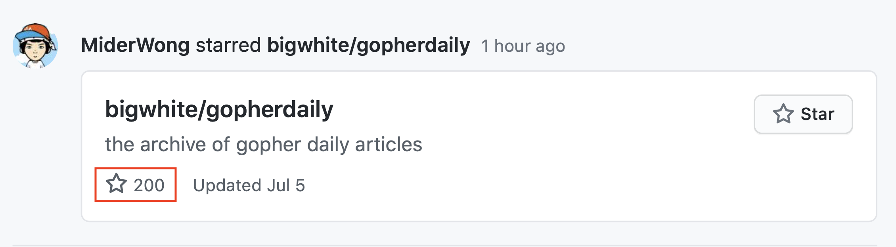

Go channel到底有多快 | Gopher Daily (2020.07.06) ʕ◔ϖ◔ʔ

>每日一谚：The standard library is a great place to find good Go code. 

gopherdaily归档库在github上的星星数量已经over 200！感谢大家支持！希望大家继续关注，并多提宝贵建议！

有意想学习容器或Kubernets的童鞋可以了解一下我的慕课网实战课：k8s实战 - https://coding.imooc.com/class/284.html

1. Go channel到底有多快 - https://tpaschalis.github.io/channels-limitations-speed/
2. Go+发布会实录，值得认真回看，细细品味 - https://www.bilibili.com/video/BV1AD4y1S79M
3. 关系数据库操作Mock测试神器 - https://github.com/cockroachdb/copyist 
4. 填充的切片 - https://benburkert.com/posts/padded-slices/
5. kubernetes集群配置最佳实践验证 - https://github.com/FairwindsOps/polaris
6. 糟糕的抽象比代码重复代价更高 - https://www.sandimetz.com/blog/2016/1/20/the-wrong-abstraction

* gopherdaily归档：https://github.com/bigwhite/gopherdaily
* 编辑：Tony Bai (https://tonybai.com)
* 邮件订阅：https://gopher-daily.com/

