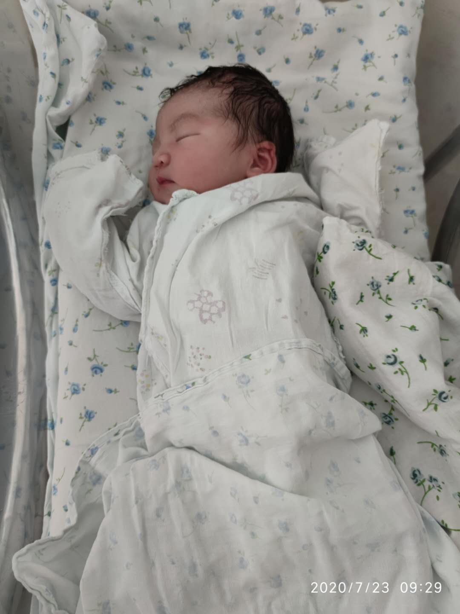

采用方括号的Go泛型出炉，来试一下吧！ | Gopher Daily (2020.07.23~07.24) ʕ◔ϖ◔ʔ

>每日一谚："Readable means Reliable. If you can read the code and know what it means, then it's easier to understand, it's easier to work on, it's easier to extend, it's easier to fix when it breaks." -- Rob Pike 

由于本人第二个女儿出生，因此7月23日的GopherDaily停更了一天。

我家二宝

有意想学习容器或Kubernets的童鞋可以了解一下我的慕课网实战课：k8s实战 - https://coding.imooc.com/class/284.html

1. Go2 playground支持采用方括号[ ]的泛型语法 - https://go2goplay.golang.org/
2. 播客：与Go语言相伴的第一周 - https://changelog.com/gotime/138
3. Go程序“浮肿”的原因分析 - https://paper.dropbox.com/doc/Bloaty-Puffs-and-the-Go-Compiler-YiblPOe6AD2tKfEj5RzFT
4. Go代码风格指南集合 - https://github.com/dgryski/awesome-go-style
5. 如何用Go实现"sign with google" - https://qvault.io/2020/07/22/how-to-implement-sign-in-with-google-in-golang/
6. go-flow-levee: 该静态分析工具可确保您程序的数据流不会溢出到其库之外，从而保证避免暴露敏感数据 - https://github.com/google/go-flow-levee

* gopherdaily归档：https://github.com/bigwhite/gopherdaily
* 编辑：Tony Bai (https://tonybai.com)
* 邮件订阅：https://gopher-daily.com/

